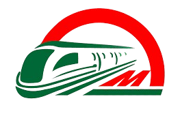

# Dhaka Metro Rail Website (Django Backend)



A collaborative project to build a modern, full-stack website for Dhaka's Metro Rail system. This repository extends the original frontend by [fzihak](https://github.com/fzihak/Dhaka-Metro) with a Django backend, enabling real-time updates, secure ticket booking, user dashboards, and journey planning.

## 🚇 Features

- **Real-time Train Updates**
  - Live schedule tracking
  - Station-wise updates
  - Service disruption notifications

- **Online Ticket Booking**
  - Single journey, round trip, and day passes
  - Dynamic fare calculation
  - Secure payment integration

- **User Dashboard**
  - Purchase and travel history
  - Active tickets
  - Account management

- **Journey Planning**
  - Interactive route map
  - Fare calculator
  - Station information
  - Estimated travel time

## 🛠️ Technologies Used

- Django (Python)
- HTML5, CSS3, JavaScript
- jQuery
- Font Awesome Icons
- Responsive Design

## 🚀 Getting Started

1. **Clone the repository:**
   ```bash
   git clone https://github.com/azimhossaintuhin/Dhaka-Metro.git
   cd Dhaka-Metro
   ```

2. **Set up the backend:**
   - Create a virtual environment and activate it:
     ```bash
     python3 -m venv venv
     source venv/bin/activate
     ```
   - Install dependencies:
     ```bash
     pip install -r requirements.txt
     ```
   - Run migrations:
     ```bash
     python manage.py migrate
     ```
   - Start the development server:
     ```bash
     python manage.py runserver
     ```

3. **Open `http://127.0.0.1:8000/` in your browser to view the website.**

## 📱 Pages

- **Home**: Landing page with key features and live updates
- **Buy Ticket**: Ticket purchasing interface
- **Dashboard**: User account management
- **Contact**: Contact information and support

## 🤝 Collaboration

This project is a collaboration between:

- [Foysal Zihak](https://github.com/fzihak) (Frontend)
- [Azim Hossain Tuhin](https://github.com/azimhossaintuhin) (Django Backend)

We welcome contributions! To get involved:

1. Fork the repository
2. Create your feature branch (`git checkout -b feature/YourFeature`)
3. Commit your changes (`git commit -m 'Add YourFeature'`)
4. Push to your branch (`git push origin feature/YourFeature`)
5. Open a Pull Request

## 📄 License

This project is licensed under the MIT License - see the [LICENSE](LICENSE) file for details.

## 👥 Contact

- Azim Hossain Tuhin - [azimhossaintuhin@gmail.com](mailto:azimhossaintuhin@gmail.com)
- Foysal Zihak - [hello@zihak.me](mailto:hello@zihak.me)

Project Link: [https://github.com/azimhossaintuhin/Dhaka-Metro](https://github.com/azimhossaintuhin/Dhaka-Metro)

## 🙏 Acknowledgments

- [fzihak/Dhaka-Metro](https://github.com/fzihak/Dhaka-Metro) for the original frontend
- [Font Awesome](https://fontawesome.com) for icons
- [jQuery](https://jquery.com) for JavaScript utilities
- Bangladesh Government for Metro Rail information

---

Made with ❤️ by [Azim Hossain Tuhin](https://github.com/azimhossaintuhin) & [Foysal Zihak](https://github.com/fzihak)
